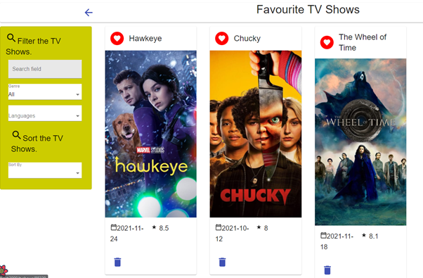

# Assignment 1 - ReactJS app.

Name: Caolan Maher

## Overview.

In the movie app, I have added a section on TV Shows to increase the usability 
of the app to allow the user more options of entertainment to look at. The user 
can now look at multiple pages of movies using the arrows on the bottom of the 
home page. The user can also filter movies and Tv Shows by name, genre, and 
language to help them find the right movie. The user can also sort the movies 
and TV Shows by top rated, least rated, popularity, and nothing 
(if they want to reset the list). The user can also tag their favorite Tv Shows 
and movies so they know what to come back to if they can’t find something to watch. 
The user must log into the site using a login form to look at certain pages such as 
the details of movies and TV Shows. The user can look at reviews of TV Shows and 
movies to see what other people think. The user does not have to worry about if 
they are using a mobile because the app includes responsive UI to accommodate for 
all users on all screens.

### Features.

+ Pagination
+ Simple Authentication
+ Hyperlinking
+ Responsiveness
+ Discover TV Shows
+ Added Languages onto filter card to filter Movies and TV Shows by supported languages
+ Added Sorting onto filter card to sort Movies and TV Shows by the following metrics:
-	Top Rated
-	Least Rated
-	Popularity
-	Nothing – to reset the sorting
+ Added Storybook support for new components
+ Full Caching Support
+ 6 new TMDB Endpoints

## Setup requirements.

In the terminal in VS Code: run the command: npm install
Also run: npm start
Setup a .env file to contain the key for you tmdb api in the value REACT_APP_TMDB_Key
Also add FAST_REFRESH=false

## API endpoints.

+ Discover list of TV Shows – discover/tv
+ TV Show details – tv/id
+ Languages – configuration/languages
+ TV Show Reviews - /tv/id/reviews
+ TV Show Genres - /genre/tv/list
+ TV Show Images - /tv/id/images

## App Design.

### Component catalogue.

### UI Design.

>Shows list of movies from the discover section, 
there is a new header showing the user whether they 
are logged in or not, also on the left there is additional 
fields in the filter card, there is a field for languages 
and a sort-by option which I will show in another screenshot. 
There are also more menu options such as Top Rated for top rated movies, 
TV Shows for the discover TV Shows, and Favorite Tv Shows for the user’s favorite tagged TV Shows.
Link to get this page: /

> Shows the language options when the dropdown box is selected from the filter movie card.
Link to get this page: /

> Shows the sort-by options when the dropdown box is selected from the filter movies card.
> Link to get this page: /tvshows

Shows the footer used for pagination, 
clicking the forward arrow increases the current 
page by 1 and brings in the next page of movies. 
Clicking the back arrow decreases the current page 
by 1 and brings in the previous page of movies.
Link to get this page: /tvshows

Shows the discover page for TV Shows, 
the filter and sorting options on the left 
are the same as the options for the movies 
so I will not include the same screenshots for those.
Link to get this page: /tvshows

Shows being able to tag TV Shows as 
favorites so they can be added to the Favorite TV Shows page
Link to get this page: /tvshows

Shows user’s favorite tagged TV Shows. 
User has the option to remove each one from the list.
Link for this page: /tvshows/favorites

Shows that the user can login to get access 
to private route pages. Only if the user 
inputs the correct information will they be authenticated.
Link for this page: /login

If the user inputs the wrong credentials, 
they will be given an alert informing them of incorrect credentials.
Link for this page: /login

Shows the movie details, this is not a new feature and I have only included this screenshot 
so I can demonstrate the responsive UI in the next screenshot. 
Also shows the header has been changed to say Welcome and allows the user to log out.
Link for this page: /movies/580489

Shows the responsive UI in the details page, 
if the screen gets too small, the images that 
were there on the left are removed and the movie 
details takes up the entire width instead.
Link for this page: /movies/580489

Shows the details page for TV Shows, where it 
displays the overview, genres, production countries, 
episode count, rating, and date of the first episode 
being aired. It also includes a section to get the reviews of a TV Show.
Link for this page: /tvshows/88329

Shows the reviews attached to a TV 
Show when the reviews button is clicked on.
Link for this page: tvshows/60735

Shows the full review of a show.
Link for this page: tvshowreviews/5f98b89877e1f600358ada9f

Shows the top-rated movies using the top-rated endpoint.
Link for this page: movies/top_rated.

Shows the caching support of the app.

### Routing.

+ /tvshows – Displays the discover page of TV Shows
+ /tvshows/:id – Displays the details page of the selected show
+ /movies/top_rated – Displays a page of top-rated movies.
+ /login – Displays a login page for the user to input their credentials
+ /tvshowreviews/:id – Displays a full review for a TV Show
+ tvshows/favorites – Displays the tagged favorite TV Shows.

I have put PrivateRoutes on the following routes:
- /reviews/:id – Displays the full review of a movie
- /tvshowreviews/:id – Displays the full review of a TV Show
- /movies/favorites – Displays the tagged favorite movies.
- /tvshows/favorites – Displays the tagged favorite TV Shows.
- /movies/playlist – Displays the tagged must-watch movies.
- /movies/:id – Displays the movie details.
- /tvshows/:id – Displays the Tv Show details.

The following routes are public routes:
- /tvshows – Displays the discover page for TV Shows
- /movies/upcoming – Displays the upcoming movies
- /movies/top_rated – Displays the top-rated movies
- /reviews/form – Displays the form to submit a review
- /login – Displays the form to login
- / - Displays the home page

## Independent learning (If relevant).

I researched the react-query support on pagination using this 
link: https://react-query.tanstack.com/guides/paginated-queries 
and I was able to implement it into my home page to get different 
pages of movies. 
I implemented it in the file:
- pages/homepage.js

I researched simple authentication using sample user and sample credentials. 
I input a login form in the login page for the user to input these credentials. 
I implemented it using the following files:
- /components/users/index.js – stores the sample users and credentials
- /contexts/authContext.js – checks the user’s input against the sample users to check if credentials match.

